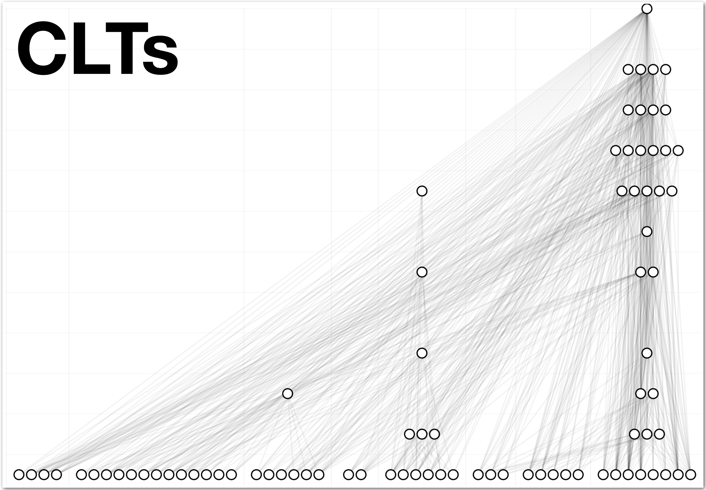

<p align="center">
  
</p>

# CLT

[]()
[]()
[]()
[](https://opensource.org/licenses/MIT)

**CLT** is a Python library for training Cross-Layer Transcoders (CLTs) at scale.

We believe that a major limitation in the development of CLTs, and more broadly attribution graph methods, is the significant engineering effort required to train, analyze, and iterate on them. This library aims to reduce that overhead by providing a clean, scalable, and extensible framework.

## Features

This library currently implements L1-regularized CLTs with the following design principles:

- Follows [Anthropic](https://transformer-circuits.pub/2025/january-update/index.html)'s training guidelines
- Supports feature sharding across GPUs (as well as DDP and FSDP)  
- Includes activation caching and compression/quantization of the activations  
- Adopts a structure similar to [SAE Lens](https://github.com/jbloomAus/SAELens) (code design, activation-store, etc.) and uses [Transformer Lens](https://github.com/TransformerLensOrg/TransformerLens)

## Compatibility and Tooling

CLTs trained with this library are compatible with [circuit-tracer](https://github.com/safety-research/circuit-tracer) workflows.

We also plan to release (March 2026):
- An automatic interpretability pipeline  
- A visual interface for exploring features and attribution graphs  
  - Similar in spirit (but simpler) to [Neuronpedia](https://github.com/hijohnnylin/neuronpedia)
  - Including attention attribution support (as in [SparseAttention]https://arxiv.org/abs/2512.05865)

## Quick Start

Training happens in **two steps**:

1.  **Precompute activations** (should be parallelized across indepedent jobs)\
2.  **Train the CLT model** on the cached activations (should run on a single multi-gpu node)

------------------------------------------------------------------------

### 1. Generate and cache activations

``` python
from clt import ActivationsStore, clt_training_runner_config, load_model

# Load model
model = load_model("gpt2-small", device="cuda")

# Create config
cfg = clt_training_runner_config()

# Create activation store
store = ActivationsStore(model, cfg)

# Generate and cache activations
store.generate_and_save_activations(
    path=cfg.cached_activations_path,
    use_compression=True,  # optional
)
```

------------------------------------------------------------------------

### 2. Train the CLT

``` python
from clt import CLTTrainingRunner

# Train
trainer = CLTTrainingRunner(cfg)
trainer.run()
```

------------------------------------------------------------------------

## ⚙️ Notes
-   We provide screenshot examples of training metrics in the [output](./outputs) folder
-   The activation generation step is typically ran on large datasets
    (e.g. \~200M tokens from [The Pile](https://pile.eleuther.ai))
-   Compression is optional but recommended for large-scale runs
-   Use bf16 for big models (autocasting with activations and weights in bf16 but final loss and gradient states in 32)
-   Use gradient accumulation if needed to reach 4-8k batch
-   We provide a sample script to map model weigths to [circuit-tracer](https://github.com/safety-research/circuit-tracer) in the [file](./src/clt/circuit-tracer/map_to_circuit_tracer.py). 

## Contributing

We welcome contributions to the library.
Please refer to [CONTRIBUTING.md](CONTRIBUTING.md) for guidelines and templates.
